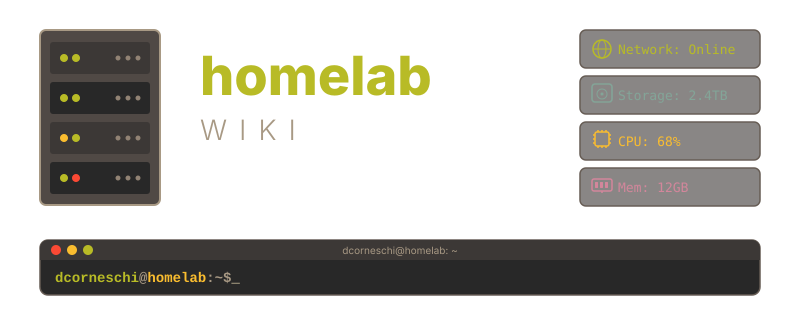

Quick reference guides, command tables, and longer-form write-ups covering Kubernetes, container runtimes, networking, terminal tooling, and infrastructure as code — all tailored to a self-hosted homelab environment.

 

## Usage

This site is built with [docsify](https://docsify.js.org/) and served via GitHub Pages. Browse the sidebar or click an article to get started. Search is available in the sidebar to quickly find specific commands across all guides.

## What's Inside

### Kubernetes

| Article | Description |
|---------|--------------|
| [Using jq with kubectl](articles/kubectl-jq-guide.md) | Composing jq commands for kubectl JSON output — filtering, aggregation, formatting, and scripts. |
| [kubectl JSONPath Guide](articles/kubectl-jsonpath-guide.md) | Built-in JSONPath expressions — pods, nodes, services, storage, events, and formatting. |
| [Getting Started with Argo CD](articles/getting-started-argo.md) | Installing ArgoCD and deploying your first application. |
| [Kubernetes imagePullPolicy](articles/kubernetes-imagepullpolicy.md) | How `imagePullPolicy` controls image pulling behavior. |
| [Kubernetes emptyDir Volumes](articles/kubernetes-emptyDir-volumes.md) | How `emptyDir` volumes work and sharing files between containers. |
| [Kubernetes PriorityClasses Guide](articles/kubernetes-priority-classes-guide.md) | How PriorityClasses control scheduling and preemption. |
| [Kubernetes QoS Classes — Requests and Limits](articles/kubernetes-qos-requests-limits.md) | QoS classes, eviction order, OOM kill priority, and the CPU limits debate. |
| [Kubernetes Pod Evictions Cheatsheet](articles/kubernetes-evictions-cheatsheet.md) | Eviction methods, PDB respect, graceful termination, and eviction actors. |
| [Kubernetes PodDisruptionBudgets Guide](articles/kubernetes-pdb-guide.md) | How PDBs protect availability during voluntary disruptions. |
| [kubectl run vs kubectl create](articles/kubectl-run-vs-create.md) | When to use `kubectl run` (bare Pods) vs `kubectl create` (other resources). |
| [Init Containers vs Regular Containers](articles/kubernetes-init-vs-regular-containers.md) | Lifecycle differences, kubelet orchestration, cgroup allocation, and use cases. |
| [Ingress for Kubernetes Dashboard on MicroK8s](articles/ingress-kubernetes-dashboard-microk8s.md) | Exposing the Kubernetes Dashboard through Ingress on MicroK8s. |
| [Ingress with MetalLB on MicroK8s](articles/ingress-metallb-microk8s-guide.md) | NGINX Ingress with MetalLB for bare-metal load balancing. |
| [NFS Storage for MicroK8s](articles/nfs-microk8s-installation.md) | NFS CSI driver on MicroK8s for persistent volumes. |
| [Helm Cheatsheet](articles/helm-cheatsheet.md) | Package manager for Kubernetes — repos, installs, upgrades, and rollbacks. |
| [crictl Cheatsheet](articles/crictl-cheatsheet.md) | CLI for inspecting and debugging container runtimes at the CRI level. |
| [k9s Cheatsheet](articles/k9s-cheatsheet.md) | Terminal UI for navigating and managing Kubernetes clusters. |

### Docker

| Article | Description |
|---------|--------------|
| [Docker Cheatsheet](articles/docker-cheatsheet.md) | Docker CLI — containers, images, volumes, networks, Dockerfile, and troubleshooting. |
| [Docker Compose Cheatsheet](articles/docker-compose-cheatsheet.md) | Docker Compose — services, builds, networks, volumes, profiles, overrides, and patterns. |
| [Docker Compose: ports vs expose](articles/docker-ports-vs-expose.md) | Differences between `ports` and `expose` — when to publish vs keep internal. |
| [Fix Gitea Runner Docker Hub Rate Limits](articles/docker-gitea-runner-fix.md) | Mounting Docker config into the runner to avoid rate limiting. |
| [dbash — Docker Shell Function](articles/docker-dbash-function.md) | Bash function to quickly shell into Docker containers. |

### AWS

| Article | Description |
|---------|--------------|
| [AWS CLI Installation](articles/aws-cli-install.md) | Install AWS CLI v2 on RHEL, Ubuntu, macOS — configuration, profiles, auto-completion, and Docker. |
| [EC2 Cheatsheet](articles/aws-ec2-cheatsheet.md) | AWS EC2 — instances, AMIs, security groups, EBS, Elastic IPs, metadata, and CLI patterns. |
| [EC2 Extend EBS Volume](articles/aws-ec2-extend-disk.md) | Resize EBS volumes and grow filesystems (XFS, ext4, LVM) — no downtime required. |
| [Installing SSM Agent](articles/aws-ssm-agent-install.md) | Install and configure SSM Agent on RHEL, Ubuntu — Session Manager, VPC endpoints, and SSH over SSM. |
| [JMESPath Query Guide](articles/aws-jmespath-guide.md) | JMESPath query language for AWS CLI — filtering, sorting, functions, and real-world examples. |

### Virtualization

| Article | Description |
|---------|--------------|
| [Installing KVM](articles/kvm-installation.md) | KVM installation on RHEL 7–10 and Ubuntu 22.04/24.04 — packages, networking, storage, and verification. |
| [KVM / virsh Cheatsheet](articles/kvm-cheatsheet.md) | virsh commands — VM lifecycle, disks, snapshots, networks, pools, migration, and monitoring. |
| [Adding a New Disk in KVM](articles/kvm-add-disk.md) | Create, attach, partition, format, mount, resize, and detach disks in KVM guests. |
| [Enable virsh console](articles/kvm-virsh-console.md) | Configure serial console access for KVM VMs — GRUB, systemd getty, and troubleshooting. |
| [Proxmox Cheatsheet](articles/proxmox-cheatsheet.md) | Proxmox VE — VM/CT management, storage, networking, clusters, and backups. |

### Terraform

| Article | Description |
|---------|--------------|
| [Terraform Cheatsheet](articles/terraform-cheatsheet.md) | IaC tool — core commands, state management, and workspaces. |
| [terraform.tfstate vs .terraform/terraform.tfstate](articles/terraform-tfstate-vs-terraform-directory-state.md) | Difference between `terraform.tfstate` and `.terraform/terraform.tfstate`. |
| [terraform init -upgrade and Constraints](articles/terraform-init-upgrade-and-constraints.md) | How `terraform init -upgrade` works with version constraints. |
| [terraform get -update vs init -upgrade](articles/terraform-get-update-vs-init-upgrade.md) | Difference between `terraform get -update` and `terraform init -upgrade`. |
| [Terraform Lock File Checksums: zh and h1](articles/terraform-lock-file-checksums.md) | How `zh:` and `h1:` hashes in `.terraform.lock.hcl` work. |

### Bash & Shell

| Article | Description |
|---------|--------------|
| [bash Cheatsheet](articles/bash-cheatsheet.md) | GNU Bourne Again SHell — quoting, escaping, variables, loops, and built-ins. |
| [Bash Essentials Guide](articles/bash-essentials-guide.md) | Shell sessions, environment variables, quoting, history, prompt customization, and shortcuts. |
| [Bash Test Conditions: \[ \] vs \[\[ \]\]](articles/bash-test-conditions-guide.md) | Differences between `test`, `[ ]`, and `[[ ]]` — pattern matching, regex, and file tests. |
| [Bash Subshells](articles/bash-subshells-guide.md) | How subshells work, the pipeline variable problem, isolation patterns, and performance tips. |
| [Bash Troubleshooting Guide](articles/bash-troubleshooting-guide.md) | Bash debugging — `set -x`, `set -euo pipefail`, PS4, and tracing. |
| [macOS Bash Upgrade Guide](articles/macos-bash-upgrade-guide.md) | Installing a newer bash on macOS (ships with outdated 3.2.x). |
| [sed Replace Line Guide](articles/sed-replace-line-guide.md) | Using `sed` to replace entire lines based on a string match. |
| [Running Multiple Commands with sudo](articles/sudo-multiple-commands.md) | Subshells, heredocs, logical operators, pipes, and running as a specific user. |
| [sudoers Guide](articles/sudo-sudoers-guide.md) | Granting access to users, groups, and LDAP; aliases, Defaults, logging, and tips. |
| [Vim White Spaces](articles/vim-white-spaces.md) | Configuring vim to show white spaces with custom symbols. |

### Linux System Administration

| Article | Description |
|---------|--------------|
| [Linux File Permissions Guide](articles/linux-file-permissions.md) | Permissions, ownership, umask, SUID/SGID, sticky bit, and ACLs. |
| [User Administration on RHEL](articles/user-administration.md) | User and group management — UIDs, password hashing, PAM, and chage. |
| [RHEL Releases Overview](articles/rhel-releases-overview.md) | RHEL major releases (2.1–10) — features, lifecycle, and upgrade paths. |
| [RHEL Boot Modes and Troubleshooting](articles/rhel-boot-troubleshooting.md) | Boot modes, rescue/emergency targets, and recovery techniques. |
| [Linux ulimit Guide](articles/linux-ulimit-guide.md) | Per-process resource limits, limits.conf, systemd directives, sysctl, and troubleshooting. |
| [Remove .DS_Store from Git](articles/remove-ds-store-guide.md) | Remove and prevent .DS_Store files from being tracked in git. |

### Linux Performance & I/O

| Article | Description |
|---------|--------------|
| [Linux Load Average](articles/linux-load-average.md) | What load average actually measures on Linux, how to interpret it, and common misconceptions. |
| [Linux I/O Schedulers](articles/linux-io-schedulers.md) | I/O schedulers (noop, deadline, cfq, mq-deadline, bfq, kyber), tuning, and per-distro defaults. |
| [Linux Disk I/O Internals](articles/linux-disk-io-internals.md) | Page cache, standard I/O, direct I/O, mmap, block alignment, and write durability. |
| [Configuring sysstat on Ubuntu](articles/configuring-sysstat-ubuntu.md) | Installing and configuring sysstat on Ubuntu with systemd timers. |
| [Understanding vmstat Output](articles/understanding-vmstat-output.md) | Understanding vmstat output — CPU, memory, I/O, and process scheduling diagnostics. |
| [Understanding iostat -x Output](articles/understanding-iostat-x-output.md) | Extended block device I/O statistics — granular disk performance monitoring. |
| [iotop Cheatsheet](articles/iotop-cheatsheet.md) | Interactive I/O monitoring — per-process disk read/write usage. |
| [ps Cheatsheet](articles/ps-cheatsheet.md) | Process status — listing, filtering, and inspecting running processes. |
| [top Cheatsheet](articles/top-cheatsheet.md) | Interactive process viewer — CPU, memory, sorting, filtering, and batch mode. |
| [free Cheatsheet](articles/free-cheatsheet.md) | Memory usage — free, top, /proc/meminfo, vmstat, and per-process memory. |

### Linux Memory

| Article | Description |
|---------|--------------|
| [Linux Memory: RSS, VSZ, and Why RSS Alone Is Misleading](articles/linux-memory-rss-vsz.md) | Virtual memory, RSS vs VSZ, shared pages, and accurate memory measurement. |
| [Linux Swap Usage: When Processes Aren't the Culprit](articles/linux-swap-shm-segments.md) | Why per-process swap doesn't add up — SHM segments, `/proc/sysvipc/shm`, and Oracle SGA. |

### Linux Storage & Filesystems

| Article | Description |
|---------|--------------|
| [fdisk Cheatsheet](articles/fdisk-cheatsheet.md) | Disk partitioning — fdisk, gdisk, parted, sgdisk, sfdisk, mkfs, and LVM setup. |
| [fsck Cheatsheet](articles/fsck-cheatsheet.md) | Filesystem check and repair — e2fsck, xfs_repair, badblocks, and SMART. |
| [Partition Alignment Guide](articles/partition-alignment-guide.md) | Why 1 MiB alignment matters for SSDs, 4Kn HDDs, RAID, LVM, and virtual machines. |
| [XFS Internals: Superblock and Addressing](articles/xfs-internals-superblock.md) | XFS superblock structure, allocation groups, and block/inode addressing schemes. |
| [ext4 Journal Modes](articles/ext4-journal-modes.md) | Journal modes (ordered, writeback, journal), configuration, commit intervals, and barriers. |
| [Extending Partitions with growpart](articles/growpart-extend-partitions.md) | Extend partitions online on cloud/VM instances — AWS, Azure, GCP, LVM, and troubleshooting. |

### Networking

| Article | Description |
|---------|--------------|
| [SSH Cheatsheet](articles/ssh-cheatsheet.md) | OpenSSH client and server — connections, keys, forwarding, tunnels, and troubleshooting. |
| [SSH ControlMaster](articles/ssh-controlmaster.md) | SSH connection multiplexing — reuse a single TCP connection for multiple sessions. |
| [SSH ProxyJump vs ProxyCommand](articles/ssh-proxyjump-vs-proxycommand.md) | Differences between ProxyJump and ProxyCommand for reaching hosts behind bastions. |
| [SSH Managing Multiple Keys](articles/ssh-managing-multiple-keys.md) | Per-service SSH keys for AWS, Proxmox, GitHub, and homelab — config, agent, and rotation. |
| [SSH Generate Keys](articles/ssh-keygen-guide.md) | Generate Ed25519, RSA, and ECDSA keys — passphrases, options, FIDO2, and security hardening. |
| [SSH Convert Keys](articles/ssh-convert-keys.md) | Convert between OpenSSH, PuTTY PPK, PEM, PKCS#8, DER, and SSH.com key formats. |
| [SSH Remote Script Execution](articles/ssh-remote-script-execution.md) | Tools for running scripts on remote hosts — SSH, pssh, pdsh, Ansible, Fabric, and more. |
| [ss Cheatsheet](articles/ss-cheatsheet.md) | Socket statistics — inspecting TCP/UDP connections and states. |

### Cloud-Init

| Article | Description |
|---------|--------------|
| [cloud-init Cheatsheet](articles/cloud-init-cheatsheet.md) | Cross-platform cloud instance initialization — user-data, modules, networking, and debugging. |
| [cloud-init: bootcmd vs runcmd](articles/cloud-init-bootcmd-vs-runcmd.md) | Boot stages, execution timing, frequency differences, and common mistakes. |
| [cloud-init: Why tee Output Doesn't Appear in Logs](articles/cloud-init-tee-output-missing.md) | How cloud-init's output directive interacts with tee, buffering, and pipes. |
| [cloud-init: User Management and the gecos Field](articles/cloud-init-users-gecos.md) | Users module, gecos history, all user keys, default user, and common patterns. |

### Terminal & Tools

| Article | Description |
|---------|--------------|
| [JSON Query Tools: JMESPath vs jq vs JSONPath](articles/json-query-tools.md) | Comparing JMESPath, jq, and JSONPath — syntax, filtering, transformation, and when to use each. |
| [bat Cheatsheet](articles/bat-cheatsheet.md) | A cat clone with syntax highlighting, git integration, themes, and paging. |
| [cut Cheatsheet](articles/cut-cheatsheet.md) | Extract fields, characters, or bytes from text — delimiters, ranges, and practical patterns. |
| [tmux Cheatsheet](articles/tmux-cheatsheet.md) | Terminal multiplexer — sessions, windows, panes, and copy mode. |
| [Kitty Cheatsheet](articles/kitty-cheatsheet.md) | GPU-accelerated terminal emulator — tabs, windows, and layouts. |
| [JetBrains Mono Font](articles/jetbrains-mono-font.md) | Free monospaced font designed for terminals and code editors. |
| [PuTTY Default Settings](articles/putty-default-settings.md) | Font, bell, colors, window size, and scrollback — settings to apply after a fresh Windows install. |

### Windows

| Article | Description |
|---------|--------------|
| [Windows Battery Report](articles/windows-battery-report.md) | Using the built-in `powercfg` tool to check battery health, usage, and degradation. |

## About

This is a personal wiki/knowledge base for tools, commands, and configurations used across a self-hosted homelab environment — spanning Kubernetes, container runtimes, networking, terminal tooling, and infrastructure as code. A collection of all commands and knowledge gathered over the last 15+ years, written as standalone Markdown references aimed at fast lookup rather than deep tutorials.

- **Author:** Daniel Corneschi
- **Site:** Built with [docsify](https://docsify.js.org/), hosted on [GitHub Pages](https://pages.github.com/)
- **Format:** All content lives in `articles/` — cheatsheets and longer-form guides side by side, with shared images in `articles/images/`
- **Scope:** Personal use — commands and examples reflect this homelab's specific setup (namespaces, socket names, config paths) and may need adjusting for other environments
