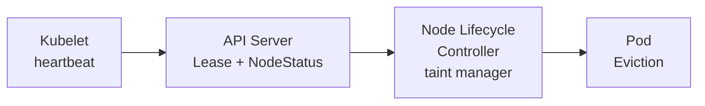
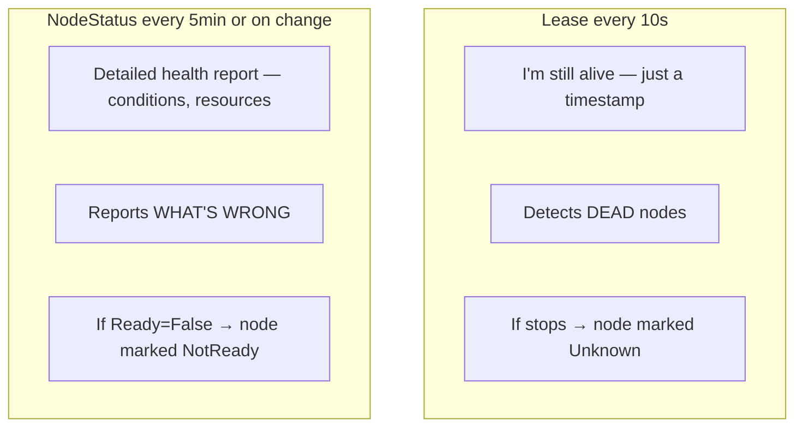
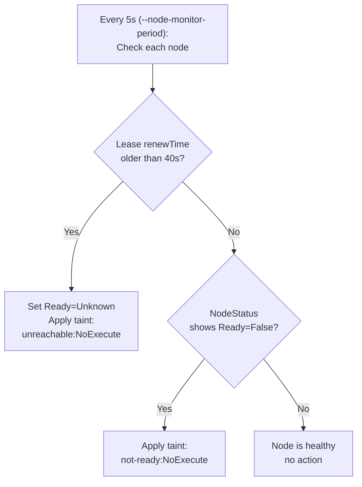
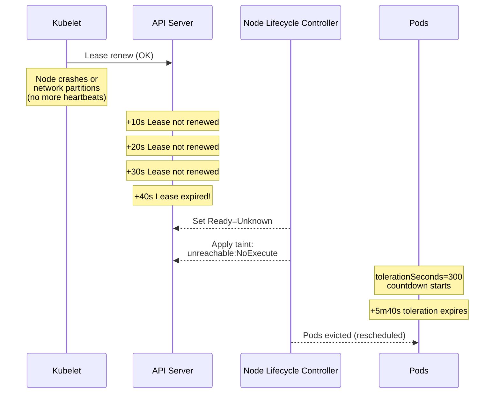
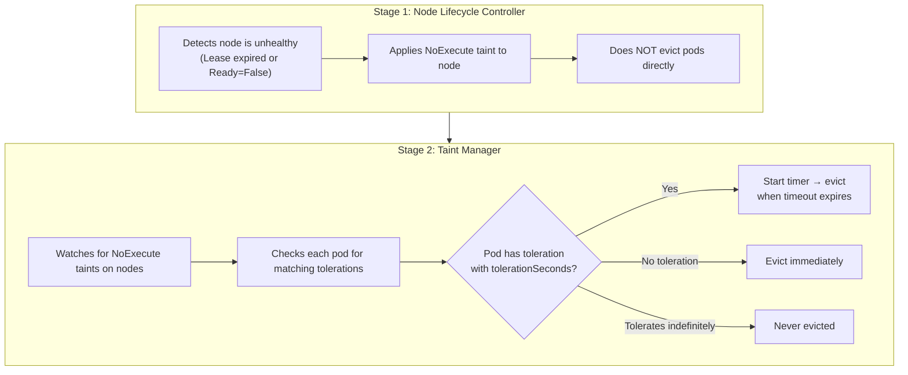

# What Happens When a Kubernetes Node Goes NotReady

The internal mechanics of node health monitoring — how the kubelet reports status, how the node lifecycle controller detects failures, applies taints, and triggers pod eviction.

Note: For EKS-specific NotReady troubleshooting (I/O spikes, CPU starvation, investigation commands), see the EKS node NotReady guide. This article covers the generic Kubernetes internals.

## High-Level Flow



## Node Health Reporting — Two Mechanisms

The kubelet reports node health via two separate mechanisms that serve different purposes:



**Key difference:**
- **Lease** answers: "Is the node alive at all?"
- **NodeStatus** answers: "Is the node healthy and functioning?"

A node can be alive (Lease renewing) but unhealthy (NodeStatus `Ready=False` because containerd crashed).

### 1. Node Lease (Lightweight Heartbeat) — "Am I Alive?"

**When it fires:** Every 10 seconds, unconditionally. The kubelet renews the Lease timestamp as long as the kubelet process is running.

**What triggers eviction:** If the Lease stops being renewed for 40 seconds (kubelet crashed, node lost network, node powered off), the node lifecycle controller marks the node `Ready=Unknown` and applies the `unreachable:NoExecute` taint.

```yaml
apiVersion: coordination.k8s.io/v1
kind: Lease
metadata:
  name: node-1              # Same as node name
  namespace: kube-node-lease
spec:
  holderIdentity: node-1
  leaseDurationSeconds: 40  # Default
  renewTime: "2024-03-15T10:00:30Z"  # Updated every 10s
```

- The Lease object is tiny (just a timestamp) — cheap to update every 10s
- This is the **primary** heartbeat mechanism since Kubernetes 1.17+
- Before Leases existed, the full NodeStatus update (expensive) was the only heartbeat

```bash
# Check a node's lease:
kubectl get lease -n kube-node-lease <node-name> -o yaml

# See renewal time:
kubectl get lease -n kube-node-lease <node-name> -o jsonpath='{.spec.renewTime}'
```

### 2. NodeStatus (Full Status Report) — "Am I Healthy?"

**When it fires:** Every 5 minutes, OR immediately when a condition changes (e.g., disk fills up, container runtime stops responding).

**What triggers eviction:** If the kubelet reports `Ready=False` (it's alive but something is broken), the node lifecycle controller applies the `not-ready:NoExecute` taint.

```yaml
status:
  conditions:
  - type: Ready
    status: "True"
    lastHeartbeatTime: "2024-03-15T10:00:30Z"
    lastTransitionTime: "2024-03-10T08:00:00Z"
    reason: KubeletReady
    message: "kubelet is posting ready status"
  - type: MemoryPressure
    status: "False"
  - type: DiskPressure
    status: "False"
  - type: PIDPressure
    status: "False"
  - type: NetworkUnavailable
    status: "False"
```

- Kubelet updates NodeStatus every **5 minutes** (or on condition change)
- Contains full conditions, allocatable resources, node info, images
- Heavier update — avoided for frequent heartbeats

```bash
# Check node conditions:
kubectl get node <name> -o jsonpath='{.status.conditions}' | jq .

# Quick ready check:
kubectl get nodes -o custom-columns=NAME:.metadata.name,STATUS:.status.conditions[-1].status,REASON:.status.conditions[-1].reason
```

## The Node Lifecycle Controller

The `node-lifecycle-controller` (inside kube-controller-manager) monitors nodes and reacts to failures:



### Key Parameters

| Parameter | Default | Description |
|-----------|---------|-------------|
| `--node-monitor-period` | 5s | How often the controller checks node health |
| `--node-monitor-grace-period` | 40s | How long to wait before marking Unknown |
| `--node-startup-grace-period` | 60s | Longer grace period during initial node boot (allows time for CNI/CSI to initialize) |
| `--default-not-ready-toleration-seconds` | 300 | Default `tolerationSeconds` injected into pods for `not-ready:NoExecute` taint |
| `--default-unreachable-toleration-seconds` | 300 | Default `tolerationSeconds` injected into pods for `unreachable:NoExecute` taint |
| `--pod-eviction-timeout` | 5m | (deprecated) Replaced by taint-based eviction with tolerationSeconds |

## Timeline: Node Becomes Unreachable



## Node Conditions and Taints

| Node Condition | Taint Applied | Effect |
|---------------|---------------|--------|
| `Ready=Unknown` (heartbeat timeout) | `node.kubernetes.io/unreachable:NoExecute` | Pods evicted after tolerationSeconds |
| `Ready=False` (kubelet reports unhealthy) | `node.kubernetes.io/not-ready:NoExecute` | Pods evicted after tolerationSeconds |
| `MemoryPressure=True` | `node.kubernetes.io/memory-pressure:NoSchedule` | No new pods scheduled |
| `DiskPressure=True` | `node.kubernetes.io/disk-pressure:NoSchedule` | No new pods scheduled |
| `PIDPressure=True` | `node.kubernetes.io/pid-pressure:NoSchedule` | No new pods scheduled |
| `NetworkUnavailable=True` | `node.kubernetes.io/network-unavailable:NoSchedule` | No new pods scheduled |

The difference between `unreachable` and `not-ready`:
- **unreachable**: Lease expired — we don't know the node's actual state (network partition, node crash)
- **not-ready**: Kubelet actively reported it's unhealthy (e.g., container runtime down)

## Pod Eviction via Taint-Based Mechanism

Pod eviction on NotReady nodes is a **two-stage pipeline** handled by two separate components inside `kube-controller-manager`:



**The Taint Manager is what actually deletes (evicts) the pods. The Node Lifecycle Controller only applies the taint.**

This replaced the old `--pod-eviction-timeout` flag (deprecated since 1.13). Taint-based eviction is more flexible because each pod can control its own eviction behavior via `tolerationSeconds`.

When a NoExecute taint is applied, the taint manager evicts pods that don't tolerate it:

### Default Tolerations (Added Automatically)

The default admission controller adds these tolerations to every pod:

```yaml
tolerations:
- key: node.kubernetes.io/not-ready
  operator: Exists
  effect: NoExecute
  tolerationSeconds: 300    # 5 minutes
- key: node.kubernetes.io/unreachable
  operator: Exists
  effect: NoExecute
  tolerationSeconds: 300    # 5 minutes
```

This means: after a node goes NotReady/Unreachable, pods stay for 5 minutes before eviction. This allows time for transient issues to recover.

### What "Eviction" Means Here

For `unreachable` nodes, the API server can't communicate with the kubelet, so:

1. API server sets `deletionTimestamp` on the pod
2. Pod status becomes `Terminating`
3. If the node is truly gone — kubelet never confirms deletion
4. Pod stays in `Terminating` until:
   - Node comes back and kubelet cleans up
   - Admin force-deletes the pod
   - Node object is deleted from the cluster

```bash
# Find pods stuck Terminating on unreachable nodes:
kubectl get pods -A --field-selector status.phase=Running -o json | \
  jq -r '.items[] | select(.metadata.deletionTimestamp != null) | 
  "\(.metadata.namespace)/\(.metadata.name) on \(.spec.nodeName)"'
```

### StatefulSet Pods — Special Behavior

StatefulSet pods have stable identity. When a node becomes unreachable:
- The StatefulSet controller does NOT create a replacement pod immediately
- It waits until the old pod is confirmed gone (force deleted or node removed)
- This prevents split-brain (two pods with same identity + same PVC)

```bash
# Force delete a stuck StatefulSet pod (after confirming node is gone):
kubectl delete pod <name> --grace-period=0 --force
```

### Toleration Tuning — Recovery Speed Tradeoffs

The `tolerationSeconds` value on pods controls how quickly workloads are rescheduled after a node failure. Different workloads benefit from different values:

| Configuration | Recovery Speed | Use Case | Tradeoff |
|--------------|:--------------:|----------|----------|
| `tolerationSeconds: 0` | Immediate | Critical monitoring agents, system pods | Causes scheduling spikes during brief network blips |
| `tolerationSeconds: 30` | Ultra-fast | Stateless apps with fast startup (APIs, frontends) | High churn risk if node recovers within seconds |
| `tolerationSeconds: 300` (default) | Balanced | Typical production workloads | Balanced protection against false positives |
| `tolerationSeconds: 900` | Slow | Heavy stateful apps, databases, data pipelines | Prolonged downtime if the node is truly dead |
| No `tolerationSeconds` (infinite) | Never | DaemonSets, node-critical agents | Pod never evicted by this taint |

```yaml
# Fast eviction for stateless APIs (30s):
spec:
  tolerations:
  - key: node.kubernetes.io/not-ready
    operator: Exists
    effect: NoExecute
    tolerationSeconds: 30
  - key: node.kubernetes.io/unreachable
    operator: Exists
    effect: NoExecute
    tolerationSeconds: 30

# Slow eviction for databases (15 minutes):
spec:
  tolerations:
  - key: node.kubernetes.io/not-ready
    operator: Exists
    effect: NoExecute
    tolerationSeconds: 900
  - key: node.kubernetes.io/unreachable
    operator: Exists
    effect: NoExecute
    tolerationSeconds: 900
```

To change the cluster-wide default (affects all new pods without explicit tolerations):

```bash
# On the kube-controller-manager:
--default-not-ready-toleration-seconds=60
--default-unreachable-toleration-seconds=60
```

## NodeReadinessRules — Custom Health Signals

A node being `Ready` in the traditional sense (kubelet is running, container runtime responds) doesn't guarantee it can actually run pods. Common gaps:

- CNI plugin hasn't finished configuring networking
- CSI drivers haven't registered
- GPU drivers not loaded
- Node-local DNS cache not started

**NodeReadinessRules (NRR)** allow external components (CNI plugins, storage providers, custom agents) to inject additional readiness conditions that must be satisfied before the node is considered fully ready for scheduling.

### How It Works

```
┌────────────────────────────────────────────────────────────────────┐
│  Traditional Ready (kubelet only):                                 │
│    kubelet healthy + runtime healthy → Ready=True → schedule pods  │
│                                                                    │
│  With NodeReadinessRules:                                          │
│    kubelet healthy + runtime healthy                               │
│      + CNI reports ready                                           │
│      + CSI reports ready                                           │
│      + custom agent reports ready                                  │
│    → ALL conditions met → Ready=True → schedule pods               │
│                                                                    │
│  Until all conditions are met, node stays NotReady and no          │
│  workload pods are scheduled (prevents blackholing)                │
└────────────────────────────────────────────────────────────────────┘
```

### Custom Node Conditions

External agents can set custom conditions on the node object:

```yaml
status:
  conditions:
  - type: Ready
    status: "True"
  - type: NetworkReady           # Set by CNI agent
    status: "True"
  - type: StorageReady           # Set by CSI node driver
    status: "True"
  - type: GPUReady               # Set by GPU device plugin
    status: "False"              # ← Not ready yet, block scheduling
```

This pattern ensures a node isn't marked schedulable until ALL infrastructure components are fully operational — preventing the common issue where pods are placed on a node that joined the cluster but lacks networking or volume mount capability.

```bash
# Check custom conditions on a node:
kubectl get node <name> -o jsonpath='{.status.conditions[*].type}'

# Find nodes where a custom condition is False:
kubectl get nodes -o json | jq -r '.items[] | select(.status.conditions[] | select(.type=="NetworkReady" and .status=="False")) | .metadata.name'
```

## Node Recovery

When the node comes back online:

```
Node recovers → Kubelet starts → Lease renewed → Controller removes taints
     │
     ├── Pods that were only marked Terminating: kubelet kills them
     ├── Taints removed: new pods can be scheduled
     └── Previously evicted pods: already rescheduled elsewhere (won't come back)
```

```bash
# Check if taints were removed after recovery:
kubectl describe node <name> | grep Taints
```

## Large Cluster Considerations

### Rate-Limited Eviction

In large clusters, the node lifecycle controller rate-limits evictions to prevent cascading failures:

```
┌────────────────────────────────────────────────────────┐
│  Eviction Rate Limiting                                │
│                                                        │
│  --unhealthy-zone-threshold: 0.55 (default)            │
│  --large-cluster-size-threshold: 50 (default)          │
│                                                        │
│  If > 55% of nodes in a zone are unhealthy:            │
│    → Eviction rate reduced to secondary rate           │
│    → Prevents mass eviction during zone failures       │
│                                                        │
│  If cluster has < 50 nodes AND > 55% unhealthy:        │
│    → Evictions STOP entirely                           │
│    → Assumes cluster-wide issue, not node issue        │
└────────────────────────────────────────────────────────┘
```

| Scenario | Eviction Behavior |
|----------|-------------------|
| Single node failure (large cluster) | Normal rate — pods evicted after tolerationSeconds |
| Multiple nodes in one zone (>55% unhealthy) | Reduced rate — slower eviction |
| Small cluster with majority nodes failing | Evictions paused — assumes systemic issue |

### Zone-Aware Eviction

If the cluster spans multiple zones:
- Each zone's health is evaluated independently
- A healthy zone evicts at normal rate
- An unhealthy zone (>55% NotReady) evicts at reduced rate
- This prevents a network partition from emptying an entire zone

## Kubelet Reasons for NotReady

Common reasons the kubelet reports `Ready=False`:

| Reason | Meaning |
|--------|---------|
| `KubeletNotReady` | Container runtime not responding |
| `KubeletReady` → `KubeletNotReady` | Runtime crashed after being healthy |
| `NetworkPluginNotReady` | CNI plugin failed or not configured |
| `PLEG is not healthy` | Pod Lifecycle Event Generator stuck |
| `ContainerRuntimeNotReady` | containerd/CRI-O down |

```bash
# Check kubelet logs for the cause:
journalctl -u kubelet --since "10 minutes ago" | grep -i "not ready\|error\|failed"

# Check container runtime:
systemctl status containerd
crictl info
```

## Monitoring Node Health

```bash
# List node conditions:
kubectl get nodes -o custom-columns='NAME:.metadata.name,READY:.status.conditions[?(@.type=="Ready")].status,SINCE:.status.conditions[?(@.type=="Ready")].lastTransitionTime'

# Find NotReady nodes:
kubectl get nodes | grep -v " Ready"

# Check lease freshness:
kubectl get leases -n kube-node-lease -o custom-columns='NODE:.metadata.name,RENEW:.spec.renewTime'

# Watch node status changes:
kubectl get nodes -w

# Events related to node issues:
kubectl get events --field-selector reason=NodeNotReady
kubectl get events --field-selector reason=NodeReady

# Find nodes currently tainted as not-ready:
kubectl get nodes -o json | jq '.items[] | select(.spec.taints != null) | .metadata.name + " " + (.spec.taints[] | select(.key=="node.kubernetes.io/not-ready") | .key)'
```

## Quick Reference

```bash
# Node heartbeat mechanism:
# - Lease in kube-node-lease namespace (every 10s)
# - NodeStatus conditions (every 5m or on change)

# Grace period before marking Unknown:
# - 40s (--node-monitor-grace-period)

# Default pod tolerance before eviction:
# - 300s (tolerationSeconds on not-ready/unreachable taints)

# Total time from node failure to pod rescheduling:
# - ~5m 40s (40s detection + 300s toleration)

# Check node lease
kubectl get lease -n kube-node-lease <node>

# Check node conditions
kubectl get node <node> -o jsonpath='{.status.conditions[?(@.type=="Ready")]}'

# Check taints applied
kubectl describe node <node> | grep -A5 Taints

# Find pods affected by NotReady node
kubectl get pods -A --field-selector spec.nodeName=<node>

# Force delete stuck Terminating pods (node is gone permanently)
kubectl delete pod <name> --grace-period=0 --force
```
